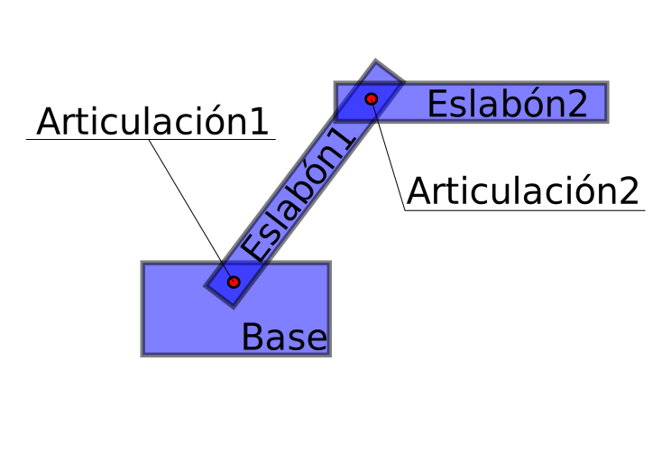
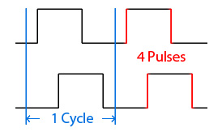
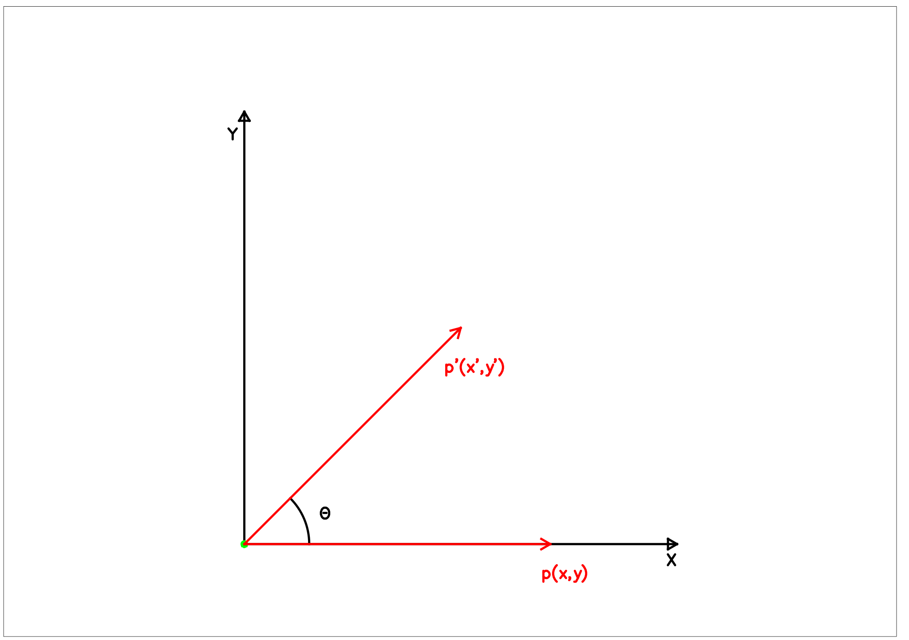
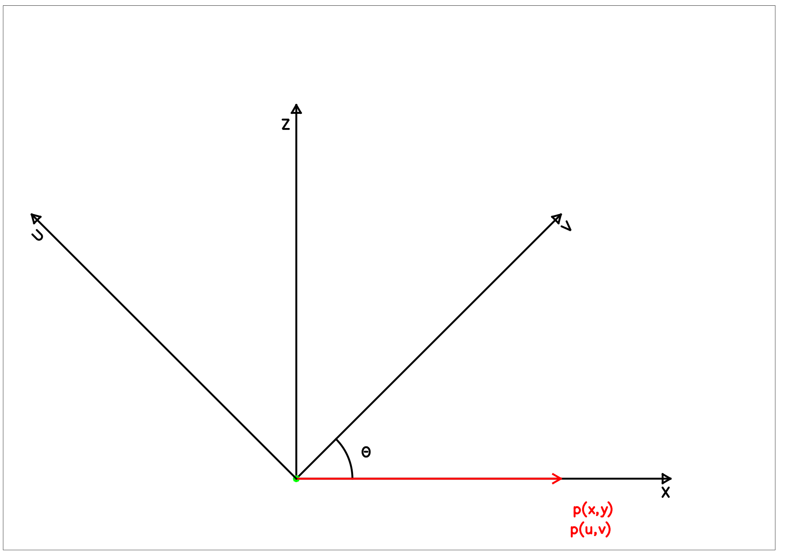
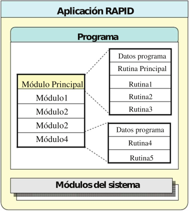
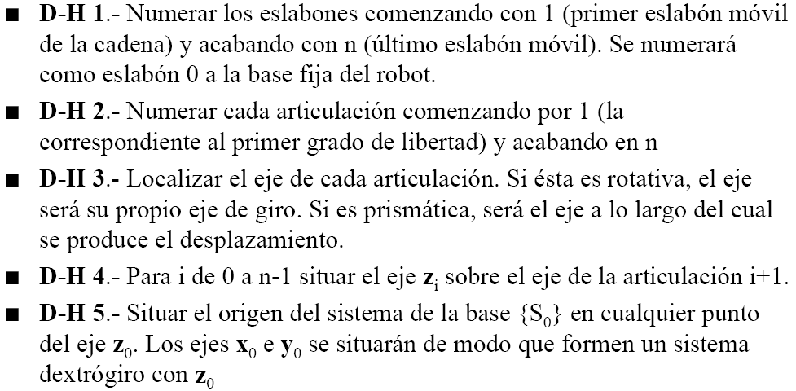
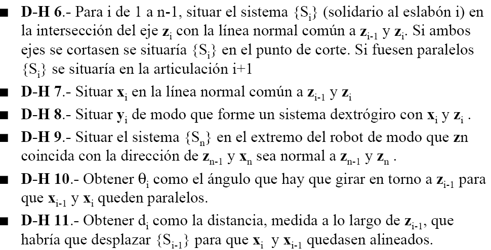
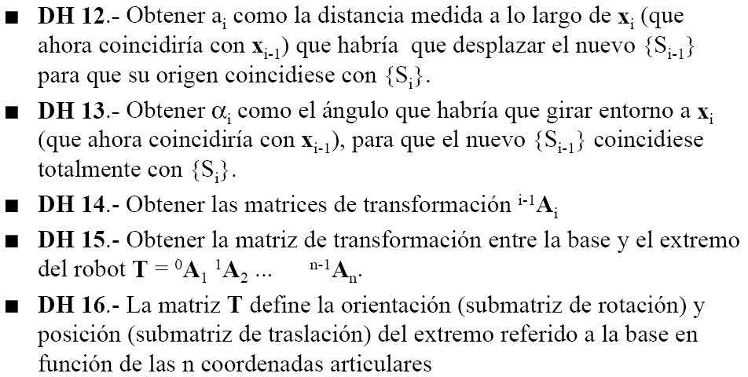

# Conceptos

En este capítulo se describirán los robots industriales, así como las partes fundamentales de las que se componen. También se describen conceptos útiles y herramientas matemáticas aplicadas al estudio y diseño de los robots en general.

## Robot industrial

Se considera un robot industrial a cualquier robot diseñado para satisfacer las necesidades de un proceso industrial.

Los robots industriales se componen de dos partes básicas, eslabones y articulaciones. Un eslabón es un sólido con dos extremos singulares. Cada uno de estos extremos forma parte de una articulación, salvo el primer eslabón que está anclado al suelo.

Aunque existen muchos tipos de robots aparte de los industriales, la mayoría se componen también de articulaciones y eslabones \(cadena cinemática\), por lo que se pueden aplicar los mismos conceptos y razonamientos a robots no industriales.

## Resolver

El funcionamiento de un resolver se muestra en la siguiente figura:

El voltaje Vr es una corriente eléctrica sinusoidal que circula por la bobina del rotor. Esta corriente produce un cambio sinusoidal del campo magnético que se detecta mediante dos bobinas situadas en el estátor.  
Una de las bobinas del estátor se hace coincidir con la posición de origen del rotor \(0º\), y se llama bobina cosenoidal, porque la corriente inducida por el campo magnético del rotor coincide con el coseno del ángulo del rotor.  
La otra bobina se desfasa \(90º\) para detectar el cuadrante en el que se encuentra el rotor mediante el signo del voltaje comparado con Vr \(fase\).  
La relación entre el voltaje inducido en el estátor y el voltaje de referencia para el resolver descrito es la siguiente:

* ++ : q1
* +- : q2
* -- : q3
* -+ : q4

Esta distribución se puede apreciar en la siguiente figura: 

## Encoder incremental en cuadratura

Es un tipo de encoder incremental que utiliza dos sensores ópticos con un desplazamiento de ¼ de ranura el uno del otro.

Esta disposición genera dos señales de pulsos desfasados en 90º o en cuadratura. Generalmente se nombran señales A y B. Gracias a estas dos señales, es posible conocer la dirección de rotación del eje. Si la señal A adelanta a la señal B, el eje rota en un sentido, mientras que si B adelanta a A, el sentido será el contrario.

Además, un encoder en cuadratura, permite detectar cuatro pulsos por cada ranura del encoder, ya que las señales A y B cambiarán cuatro veces durante el paso por la ranura: 1. \(A\) Pasa de 0 a 1. 2. \(B\) Pasa de 0 a 1. 3. \(A\) Pasa de 1 a 0. 4. \(B\) Pasa de 1 a 0.

La siguiente figura muestra el valor de las señales A y B durante el paso por una ranura del encoder..

## Ángulos de Euler

Los tres ángulos de Euler es un convencionalismo que sirve para describir la rocatión espacial de un objeto sólido.  
Según esta convención, hay dos tipos de rotaciones; intrínsecas y extrínsecas.

* Extrínseca: se realiza alrededor de un eje externo al objeto.
* Intrínseca: se realiza alrededor de un eje ligado al objeto.

Para describir la rotación de Euler, se utilizan las letras:

* X,Y,Z para los ejes iniciales.
* U,V,W para denotar los nuevos ejes.
* $$\alpha, \phi, \theta$$ para los ángulos.

La siguiente animación muestra una rotación mediante tres ángulos de Euler de tipo intrínseco. El eje extrínseco \(azul\) permanece invariable, mientras que los ejes intrínsecos \(rojo, amarillo y verde\) varían respecto al eje extrínseco.

Si el eje que apunta hacia arriba es el eje Z, y el eje que apunta hacia la izquierda es el eje X, la rotación mostrada corresponde al convencionalismo WUW \(también llamado ZXZ en la bibliografía\) , esto es:

* W: Rotación en Z \(intrínseco\).
* U: Rotación en X \(intrínseco\).
* W: Rotación en Z \(intrínseco\).

## Cuaternios

Un cuaternio es un vector de cuatro valores representados en la base $$(1,i,j,k)$$. La base $$1$$ representa la recta real, y por lo tanto el primer número del vector se corresponde con un escalar. Las bases $$(i,j,k)$$ representan tres ejes imaginarios perpendiculares, y se puede ver como una representación del espacio tridimensional.

Una de las aplicaciones de los cuaternios es la descripción de rotaciones en el espacio.

Según el teorema de rotación de Euler, para cualquier giro o combinación de giros de un sólido rígido en un espacio tridimensional, existe un eje de giro y un ángulo que describen el giro. Los cuaternios se pueden usar para representar este eje-ángulo de la siguiente manera:

$$
\mathbf{q} = e^{\frac{\theta}{2}{(u_x\mathbf{i} + u_y\mathbf{j} + u_z\mathbf{k})}} =
\cos \frac{\theta}{2} + (u_x\mathbf{i} + u_y\mathbf{j} + u_z\mathbf{k}) \sin \frac{\theta}{2} =
\sin \frac{\theta}{2} (1/\tan \frac{\theta}{2} + (u_x\mathbf{i} + u_y\mathbf{j} + u_z\mathbf{k}))
$$

Lo que también se puede escribir con notación de vector de la base $$(1,i,j,k)$$ :

$$
\mathbf{q} = (\cos \frac{\theta}{2} ,\sin \frac{\theta}{2} \cdot u_x ,\sin \frac{\theta}{2} \cdot u_y,\sin \frac{\theta}{2} \cdot u_z)= 
\sin \frac{\theta}{2}*(1/\tan \frac{\theta}{2} , u_x , u_y, u_z)
$$

Siendo $$\theta$$ el ángulo de giro alrededor del eje, y $$(u_x\mathbf{i} + u_y\mathbf{j} + u_z\mathbf{k})$$ el vector unitario que define el eje de giro.

Una de las ventajas de los cuaternios es que para concatenar rotaciones **intrínsecas**, sólo hace falta multiplicar los cuaternios en el orden correcto.  
Hay que destacar que no se trata del producto vectorial común. La multiplicación de dos cuaternios se realiza mediante una operación llamada producto Hamiltoniano, en el que también se multiplican los vectores de la base.

La multiplicación de cuaternios $$q_a=(a_1+a_2i+a_3j+a_4k) \ ; \ q_b=(b_1+b_2i+b_3j+b_4k)$$ se hace de la siguiente manera:

$$
\begin{matrix}
q_a * q_b =\\
a_1b_1+a_1b_2i+a_1b_3j+a_1b_4k+\\
a_2ib_1+a_2ib_2i+a_2ib_3j+a_2ib_4k+\\
a_3jb_1+a_3jb_2i+a_3jb_3j+a_3jb_4k+\\
a_4kb_1+a_4kb_2i+a_4kb_3j+a_4kb_4k\\
\end{matrix}
$$

Reordenando término, y teniendo en cuenta que:

$$
i^2=j^2=k^2=ijk=-1
$$

$$
\begin{matrix}
ij  = k\\
ji  = -k\\
jk  = i\\
kj  = -i\\
ki  = j \\
ik  = -j
\end{matrix}
$$

El resultado es el siguiente:

$$
q_a * q_b = (a_1b_1 - a_2b_2 - a_3b_3 - a_4b_4)
+ (a_1b_2 + a_2b_1 + a_3b_4 - a_4b_3)i
+ (a_1b_3 - a_2b_4 + a_3b_1 + a_4b_2)j +
(a_1b_4 + a_2b_3 - a_3b_2 + a_4b_1)k
$$

## Matrices de rotación

Una matriz de rotación describe una rotación en un espacio Euclídeo.

Si se considera la siguiente figura:

El punto definido por el vector $$p=(x,y)$$ efectúa una rotación alrededor del origen de coordenadas  
El nuevo punto rotado, $$p'$$, equivale a:

$$
\begin{pmatrix}
x' \\
y' \\
\end{pmatrix} =
\begin{pmatrix}
\cos \theta & -\sin \theta \\
\sin \theta & \cos \theta \\
\end{pmatrix}\begin{pmatrix}
x \\
y \\
\end{pmatrix}
$$

$$
p'=
R\cdot p
$$

Donde $$R$$ es la matriz de rotación.  
Este tipo de rotación se llama transformación activa, y es útil para calcular rotaciones **sin** cambiar el origen de coordenadas

Si la intención es describir un cambio de coordenadas, como en la siguiente figura:

La matriz de rotación sirve para obtener las coordenadas del vector $$p$$ en el otro sistema de referencia mediante la siguiente ecuación:

$$
\begin{pmatrix}
x \\
y \\
\end{pmatrix} =
\begin{pmatrix}
\cos \theta & -\sin \theta \\
\sin \theta & \cos \theta \\
\end{pmatrix}\begin{pmatrix}
u \\
v \\
\end{pmatrix}
$$

O de otra manera:

$$
p_{xy}=R \cdot p_{uv}
$$

Hay que tener en cuenta que la ecuación anterior calcula las coordenadas del punto $$p$$ en el sistema XY a partir de las coordenadas de $$p$$ en el sistema UV. Si lo que se busca son las coordenadas de $$p$$ en la base UV, la ecuación correcta sería:

$$
p_{uv}=R^{-1} \cdot p_{xy}
$$

Como recordatorio del funcionamiento de la matriz, se denota de la siguiente manera:

$$
p_{xy}=^{xy}R_{uv} \cdot p_{uv}
$$

De igual manera, se puede describir el cambio de sistema de coordenadas en tres dimensiones mediante una matriz de rotación.

$$
p_{xyz}= ^{xyz}R_{uvw} \cdot p_{uvw}
$$

Como en el espacio tridimensional, la orientación \(o pose\) de un sólido se describe mediante tres rotaciones elementales por el teorema de Euler, la matriz $$R$$ se puede descomponer en tres giros elementales. Para poder componer los giros, deben ser intrínsecos, de manera que la ecuación anterior se puede escribir como:

$$
p_{xyz}=R_u \times R_v \times R_w \cdot p_{uvw}
$$

No hay que olvidar que la multiplicación de matrices **no** es conmutativa, por lo que el orden de las rotaciones es importante.

## Rotaciones elementales

Una rotación se considera Elemental cuando se limita a un ángulo alrededor de uno de los ejes coordenados de un sistema de referencia. Para los ejes coordenados XYZ, las matrices de rotación elemental son las siguientes:

$$
R_x(\alpha) = \begin{pmatrix}
1 & 0 & 0 \\
0 & \cos \alpha &  -\sin \alpha \\
0 & \sin \alpha  &  \cos \alpha \\
\end{pmatrix}
$$

$$
R_y(\phi) = \begin{pmatrix}
\cos \phi & 0 & \sin \phi \\
0 & 1 & 0 \\
-\sin \phi & 0 & \cos \phi \\
\end{pmatrix}
$$

$$
R_z(\theta) = \begin{pmatrix}
\cos \theta &  -\sin \theta & 0 \\
\sin \theta & \cos \theta & 0\\
0 & 0 & 1\\
\end{pmatrix}
$$

## Matrices homogéneas de transformación

Se puede representar una transformación entre dos sistemas de coordenadas mediante matrices homogéneas.  
Un vector o matriz homogéneos tienen una dimensión más que el espacio que representan, por tanto una matriz homogénea tendrá dimensión 4x4 para el espacio de tres dimensiones.

Esta matriz está compuesta por cuatro submatrices:

* Una matriz de rotación de 3x3
* Un vector de traslación de 1x3
* Un vector de perspectiva de 3x1
* Un escalar de escalado \(1x1\)

Su situación dentro de la matriz homogénea es la siguiente:

$$
\begin{pmatrix}
Rotacion & Traslacion\\
Perspectiva & Escalado \\
\end{pmatrix}
$$

$$
\begin{pmatrix}
\begin{bmatrix}
r_{11} & r_{12} & r_{13} \\
r_{21} & r_{22} &  r_{23} \\
r_{31} & r_{32}  &  r_{33} \\
\end{bmatrix} & \begin{bmatrix}
t_x \\
t_y \\
t_z \\
\end{bmatrix} \\
\begin{bmatrix}
p_1 & p_2 & p_3
\end{bmatrix} & [w_1] \\
\end{pmatrix}
$$

En robótica, la perspectiva y el escalado no son necesarios, por lo que la matriz de transformación se reduce a:

$$
\begin{pmatrix}
\begin{bmatrix}
r_{11} & r_{12} & r_{13} \\
r_{21} & r_{22} &  r_{23} \\
r_{31} & r_{32}  &  r_{33} \\
\end{bmatrix} & \begin{bmatrix}
t_x \\
t_y \\
t_z \\
\end{bmatrix} \\
\begin{bmatrix}
0 & 0 & 0
\end{bmatrix} & \begin{bmatrix}
1
\end{bmatrix} \\
\end{pmatrix}
$$

Y se suele escribir sin los corchetes:

$$
\begin{pmatrix}
r_{11} & r_{12} & r_{13} & t_x\\
r_{21} & r_{22} &  r_{23} & t_y \\
r_{31} & r_{32}  &  r_{33} & t_z\\
0 & 0 & 0 & 1\\
\end{pmatrix}
$$

## Inversa de una Matriz homogénea de transformación

Las matrices homogéneas se utilizan sobre todo en el cálculo cinemático del robot. Para el cálculo cinemático directo no hay que hacer ninguna operación adicional, pero para el cálculo cinemático inverso es necesario hallar las inversas de la matriz homogénea en algunos casos. Las matrices homogéneas se pueden invertir por partes, dado que es una matriz formada por submatrices. Aplicando las propiedades de las matrices de rotación se puede simplificar el cálculo en gran manera. Para hallar la matriz inversa de la transformación $$^{S0}A_{S1}$$, las consideraciones a tener en cuenta son: 1. La orientación de S0 respecto de S1 coincide con la matriz inversa de rotación. 2. La inversa de la matriz de rotación coincide con su transpuesta: $$R^{-1}=R^t$$. 3. La traslación inversa coincide con la traslación hasta S0 respecto de S1. 4. La traslación respecto de S1 coincide con la traslación rotada y de signo contrario: $$-R^{-1}*t$$

De manera que para cualquier matriz de transformación homogénea$$^{S0}A_{S1}$$, la matriz inversa se puede construir por partes de la siguiente manera:

$$
^{S0}A_{S1}
=
\begin{pmatrix}
& R& & t\\
0 & 0 & 0 & 1\\
\end{pmatrix}
$$

$$
(^{S0}A_{S1})^{-1}
=
\begin{pmatrix}
& R^{-1}& & -R^{-1}*t\\
0 & 0 & 0 & 1\\
\end{pmatrix}
$$

## Rapid

RAPID es un lenguaje de programación textual de alto nivel desarrollado por la empresa ABB.  
Una aplicación RAPID consta de Módulo Principal, un programa y una serie de módulos del sistema.

La página de referencia proporcionada por la empresa ABB a fecha 10-feb-2016 sobre sus productos contiene toda la información necesaria sobre Rapid. La navegación se realiza mediante el menú de la barra izquierda.  
Los documentos relacionados con Rapid son:

* Introduction to RAPID programming - Operating manual.
* RAPID Instructions, Functions and Data types - Technical reference manual.

[http://developercenter.robotstudio.com/index.aspx?devcenter=devcentermanualstore](http://developercenter.robotstudio.com/index.aspx?devcenter=devcentermanualstore)

## Normal común a dos ejes

## Algoritmo de Denavit-Hartenberg

Denavit y Hartenberg desarrollaron este convencionalismo para describir robots y publicaron un artículo describiéndolo.

El método se basa en la transformación de un sistema de referencia $$i$$ respecto del anterior $$i-1$$, empezando desde la base del robot $$i=0$$. Utiliza matrices homogéneas para describir el cambio de sistema de referencia. Como el nuevo sistema de referencia es variable y depende de $$\theta_i$$, cada matriz de transformación será una función del ángulo girado, resultando cada matriz:

$$
^{i-1}A_i=T(\theta_i)
$$

Además de proponer el método, desarrollaron un algoritmo que permite describir cualquier cadena cinemática o robot siguiendo varios pasos. El algoritmo es el siguiente:

  

Para cada uno de los eslabones se definen cuatro parámetros:

Estos parámetros describen por completo la matriz de transformación entre un eslabón y el siguiente $$^{i-1}A_i$$, siendo el parámetro $$\theta_i$$ variable \($$d_i$$ si la articulación es prismática\), ya que corresponde al grado de libertad de la articulación, lo que permite calcular la orientación y posición del manipulador en función de las coordenadas articulares.

## Composición lineal de funciones senoidales

Cualquier combinación lineal de funciones senoidales de la misma frecuencia, es una onda senoidal de la misma frecuencia pero con distinta fase y amplitud.

En forma de ecuación sería:

$$
a \sin {(\alpha)} + b \cos {(\alpha)} = \sqrt{a^2+b^2} \sin {(\alpha+\arctan{\frac{b}{a}})}
$$

La demostración de esta identidad trigonométrica se puede realizar mediante la identidad del seno de la suma de ángulos. Basta con sustituir $$a=l\cdot \cos {(\gamma)}$$ y $$b=l\cdot \sin {(\gamma)}$$. Una vez hecha la sutitución queda:

$$
a \sin {(\alpha)} + b \cos {(\alpha)} = l \cos {(\gamma)}\sin {(\alpha)} + l \sin {(\gamma)}\cos {(\alpha)}=
l \sin {(\gamma+\alpha)}
$$

Para calcular $$l$$ y $$\gamma$$ se utiliza $$a^2+b^2$$ y $$b/a$$ en las ecuaciones de sustitución \($$a=l\cdot \cos {(\gamma)}$$ y $$b=l\cdot \sin {(\gamma)}$$\), resultando:

* $$l=\sqrt{a^2+b^2}$$
* $$\gamma=\arctan{(b/a)}$$

Existen otra ecuación para la composición lineal que utiliza la identidad del coseno de la suma de ángulos. La demostración se deja como ejercicio.

Los resultados en el cambio de fase dependen de los signos de a y b. En concreto, cuando a y b corresponden a la identidad de la resta, la diferencia de fase será hacia atrás \(negativa\).

Fin del capítulo.

