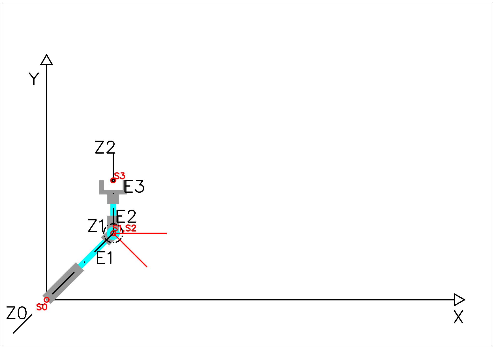
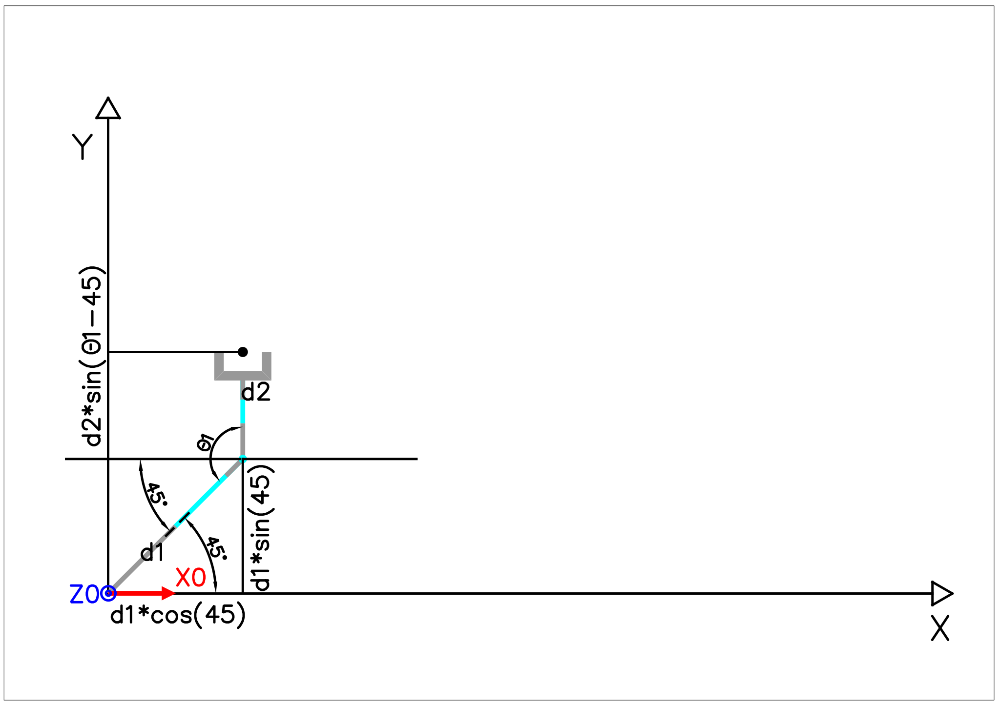

# Cinemática Inversa

## Problema 1

Hallar las ecuaciones de cinemática inversa para el robot de la figura, sabiendo que el sistema de coordenadas del manipulador se encuentra en la posición \(1212.25,690.85\) y rotado 10º respecto de la base. Comprobar si la solución mostrada es correcta y si existe alguna solución alternativa. La longitud de todos los eslabones es de 500 mm.

### Solución 1\(mediante matrices homogéneas\)

En este caso, los datos de partida son la posición y orientación del manipulador:\(x,y\)=\(1.21,0.69\) en metros, y rotado 10º respecto de la base

La matriz que describe esta transformación es:

$$
T=
\begin{pmatrix}0.98 & -0.17 & 0 & 1.21\\
 0.17 & 0.98 & 0 & 0.69\\
 0 & 0 & 1 & 0\\
 0 & 0 & 0 & 1\end{pmatrix}
$$

Partiendo de los resultados del capítulo anterior de cinemática directa, se sabe que:

$$T= \begin{pmatrix}\cos\( {\theta_{3}}+{\theta_{2}}+{\theta_{1}}\) & -\sin\( {\theta_{3}}+{\theta_{2}}+{\theta_{1}}\) & 0 & {l_{3}}\cdot \cos\( {\theta_{3}}+{\theta_{2}}+{\theta_{1}}\) +{l_{2}}\cdot \cos\( {\theta_{2}}+{\theta_{1}}\) +{l_{1}}\cdot \cos\( {\theta_{1}}\) \ \sin\( {\theta_{3}}+{\theta_{2}}+{\theta_{1}}\) & \cos\( {\theta_{3}}+{\theta_{2}}+{\theta_{1}}\) & 0 & {l_{3}}\cdot \sin\( {\theta_{3}}+{\theta_{2}}+{\theta_{1}}\) +{l_{2}}\cdot \sin\( {\theta_{2}}+{\theta_{1}}\) +{l_{1}}\cdot \sin\( {\theta_{1}}\) \ 0 & 0 & 1 & 0\ 0 & 0 & 0 & 1\end{pmatrix}

$$
Si se igualan los términos:
* $$0.98=\cos( {\theta_{3}}+{\theta_{2}}+{\theta_{1}})
$$

* $$0.17=\sin( {\theta_{3}}+{\theta_{2}}+{\theta_{1}})$$
* $$1.21={l_{3}}\cdot \cos( {\theta_{3}}+{\theta_{2}}+{\theta_{1}}) +{l_{2}}\cdot \cos( {\theta_{2}}+{\theta_{1}}) +{l_{1}}\cdot \cos( {\theta_{1}})$$
* $$0.69={l_{3}}\cdot \cos( {\theta_{3}}+{\theta_{2}}+{\theta_{1}}) +{l_{2}}\cdot \cos( {\theta_{2}}+{\theta_{1}}) +{l_{1}}\cdot \cos( {\theta_{1}})$$

Se observa que: 1. Hay mas ecuaciones que incógnitas: Es un sistema sobredeterminado. 2. Las ecuaciones son muy complejas para resolver directamente.

Para simplificar el cálculo de las incógnitas, el siguiente paso es intentar obtener ecuaciones mas simples.

Si se conocen las transformaciones parciales, y se tiene en cuenta que $$T={^{0}A_{1}}*{^{1}A_{2}}*{^{2}A_{3}}$$ se puede reorganizar la igualdad de la siguiente manera:

$$
T*({^{2}A_{3}})^{-1}={^{0}A_{1}}*{^{1}A_{2}}
$$

Para el cálculo de dicha igualdad, se necesita la inversa de la matriz $$^{2}A_{3}$$

$$
({^{2}A_{3}})^{-1}=
\begin{pmatrix}\cos( {\theta_{3}})  & \sin( {\theta_{3}})  & 0 & -{l_{3}}\\
 -\sin( {\theta_{3}})  & \cos( {\theta_{3}})  & 0 & 0\\
 0 & 0 & 1 & 0\\
 0 & 0 & 0 & 1\end{pmatrix}
$$

Por lo que a la izquierda de la igualdad resulta:

$$
LSE=
\begin{pmatrix}0.98 & -0.17 & 0 & 1.2\\
 0.17 & 0.98 & 0 & 0.69\\
 0 & 0 & 1 & 0\\
 0 & 0 & 0 & 1\end{pmatrix}
*
\begin{pmatrix}\cos( {\theta_{3}})  & \sin( {\theta_{3}})  & 0 & -0.5\\
 -\sin( {\theta_{3}})  & \cos( {\theta_{3}})  & 0 & 0\\
 0 & 0 & 1 & 0\\
 0 & 0 & 0 & 1\end{pmatrix}
$$

Y en el lado derecho de la igualdad, resulta:

$$
RSE=
\begin{pmatrix}\cos( {\theta_{1}})  & -\sin( {\theta_{1}})  & 0 & {l_{1}}\cdot \cos( {\theta_{1}}) \\
 \sin( {\theta_{1}})  & \cos( {\theta_{1}})  & 0 & {l_{1}}\cdot \sin( {\theta_{1}}) \\
 0 & 0 & 1 & 0\\
 0 & 0 & 0 & 1\end{pmatrix}
*
\begin{pmatrix}\cos( {\theta_{2}})  & -\sin( {\theta_{2}})  & 0 & {l_{2}}\cdot \cos( {\theta_{2}}) \\
 \sin( {\theta_{2}})  & \cos( {\theta_{2}})  & 0 & {l_{2}}\cdot \sin( {\theta_{2}}) \\
 0 & 0 & 1 & 0\\
 0 & 0 & 0 & 1\end{pmatrix}
$$

Después de operar y sustituir los valores conocidos, el resultado es:

$$
\begin{pmatrix}0.17\cdot \sin( {\theta_{3}}) +0.98\cdot \cos( {\theta_{3}})  & 0.98\cdot \sin( {\theta_{3}}) -0.17\cdot \cos( {\theta_{3}})  & 0.0 & 0.72\\
 0.17\cdot \cos( {\theta_{3}}) -0.98\cdot \sin( {\theta_{3}})  & 0.17\cdot \sin( {\theta_{3}}) +0.98\cdot \cos( {\theta_{3}})  & 0.0 & 0.60\\
 0.0 & 0.0 & 1.0 & 0.0\\
 0.0 & 0.0 & 0.0 & 1.0\end{pmatrix}
=
$$

$$
=
\begin{pmatrix}\cos( {\theta_{2}}+{\theta_{1}})  & -\sin( {\theta_{2}}+{\theta_{1}})  & 0 & {l_{2}}\cdot \cos( {\theta_{2}}+{\theta_{1}}) +{l_{1}}\cdot \cos( {\theta_{1}}) \\
 \sin( {\theta_{2}}+{\theta_{1}})  & \cos( {\theta_{2}}+{\theta_{1}})  & 0 & {l_{2}}\cdot \sin( {\theta_{2}}+{\theta_{1}}) +{l_{1}}\cdot \sin( {\theta_{1}}) \\
 0 & 0 & 1 & 0\\
 0 & 0 & 0 & 1\end{pmatrix}
$$

Ahora igualando términos se obtiene el siguiente sistema de ecuaciones:

$$
0.72
=
{l_{2}}\cdot \cos( {\theta_{2}}+{\theta_{1}}) +{l_{1}}\cdot \cos( {\theta_{1}})
$$

$$
0.60
=
{l_{2}}\cdot \sin( {\theta_{2}}+{\theta_{1}}) +{l_{1}}\cdot \sin( {\theta_{1}})
$$

Aunque tampoco es fácil, es un sistema de dos ecuaciones con dos incógnitas. Se ha reducido una incógnita.

Para resolver se utilizan las relaciones trigonométricas $$\sin(\alpha)^2+\cos(\alpha)^2=1$$, coseno de la suma de dos ángulos \($$\cos(\alpha+\beta)=\cos (\alpha)\cos(\beta)-\sin(\alpha)\sin(\beta)$$ y seno de la suma de dos ángulos $$\sin(\alpha+\beta)=\sin (\alpha)\cos(\beta)+\cos(\alpha)\sin(\beta)$$\), se llega al resultado:

$$
0.72^2+0.60^2=2\cdot {l_{1}}\cdot {l_{2}}\cdot \cos( {\theta_{2}}) +{l_{2}^{2}}+{l_{1}^{2}}
$$

Despejando para $$\cos(\theta_2)$$:

$$
\cos( {\theta_{2}})
=
\frac{0.72^2+0.60^2-{l_{2}^{2}}-{l_{1}^{2}}}{2\cdot {l_{1}}\cdot {l_{2}}\cdot }
$$

Y sustituyendo valores:

$$
\cos( {\theta_{2}})=\frac{0.72^2+0.60^2-0.25-0.25}{2 \cdot 0.5 \cdot 0.5} = 0.76
$$

Por lo tanto:

$$\theta_{2}=40 \deg$$ $$\theta_{2}=-40 \deg$$

Con estos valores se termina de resolver el sistema de ecuaciones para resultar:

$$\theta_{1}=20 \deg$$ $$\theta_{1}=60 \deg$$

Se deja como ejercicio la demostración de éste paso.

Por último, se puede calcular $$\theta_3$$ volviendo a las igualdades del principio.

$$
\cos( {\theta_{3}}+{\theta_{2}}+{\theta_{1}})=0.98
$$

$$
{\theta_{3}}+{\theta_{2}}+{\theta_{1}}=10\deg
$$

$$\theta_{3}=10\deg-{\theta_{2}}-{\theta_{1}}=-50 \deg$$ $$\theta_{3}=10\deg-{\theta_{2}}-{\theta_{1}}=-10 \deg$$

### Solución 2 \(desacoplamiento\)

Aprovechando la geometría del último eslabón, se puede reducir la complejidad del ejercicio mediante un cálculo geométrico previo. La posición del eslabón 3 determina la posición de S2, aunque no la orientación, como se aprecia en la figura.

Por lo tanto, las coordenadas en base S0 de S2, son:

$$
x_2=1.21-l_3*\cos(10)=1.21-0.49=0.72
$$

$$
y_2=1.21-l_3*\sin(10)=0.69-0.09=0.60
$$

También se puede calcular, como en la solución anterior,

$$
{^{0}A_{1}}*{^{1}A_{2}}
=
\begin{pmatrix}\cos( {\theta_{1}})  & -\sin( {\theta_{1}})  & 0 & {l_{1}}\cdot \cos( {\theta_{1}}) \\
 \sin( {\theta_{1}})  & \cos( {\theta_{1}})  & 0 & {l_{1}}\cdot \sin( {\theta_{1}}) \\
 0 & 0 & 1 & 0\\
 0 & 0 & 0 & 1\end{pmatrix}
*
\begin{pmatrix}\cos( {\theta_{2}})  & -\sin( {\theta_{2}})  & 0 & {l_{2}}\cdot \cos( {\theta_{2}}) \\
 \sin( {\theta_{2}})  & \cos( {\theta_{2}})  & 0 & {l_{2}}\cdot \sin( {\theta_{2}}) \\
 0 & 0 & 1 & 0\\
 0 & 0 & 0 & 1\end{pmatrix}
=
$$

$$
=
\begin{pmatrix}\cos( {\theta_{2}}+{\theta_{1}})  & -\sin( {\theta_{2}}+{\theta_{1}})  & 0 & {l_{2}}\cdot \cos( {\theta_{2}}+{\theta_{1}}) +{l_{1}}\cdot \cos( {\theta_{1}}) \\
 \sin( {\theta_{2}}+{\theta_{1}})  & \cos( {\theta_{2}}+{\theta_{1}})  & 0 & {l_{2}}\cdot \sin( {\theta_{2}}+{\theta_{1}}) +{l_{1}}\cdot \sin( {\theta_{1}}) \\
 0 & 0 & 1 & 0\\
 0 & 0 & 0 & 1\end{pmatrix}
$$

Que representa los datos de rotación y traslación de S2 respecto de S0. Por lo tanto, se puede afirmar que:

$$
0.72
=
{l_{2}}\cdot \cos( {\theta_{2}}+{\theta_{1}}) +{l_{1}}\cdot \cos( {\theta_{1}})
$$

$$
0.60
=
{l_{2}}\cdot \sin( {\theta_{2}}+{\theta_{1}}) +{l_{1}}\cdot \sin( {\theta_{1}})
$$

A partir de aquí, el cálculo se realiza de la misma manera que en la solución anterior.

### Solución 3 \(método geométrico\)

Si se explotan al máximo todos los datos geométricos disponibles del robot, se puede simplificar el cálculo aún mas.

En la figura se aprecian varias medidas y ángulos para una de las posiciones del robot.

Primero se calculan los valores para la línea $$l$$.

$$
\alpha=\arctan(y_2/x_2)=40\deg
$$

$$
l=\sqrt{x^2+y^2}= 0.94[m]
$$

Ahora, teniendo en cuenta el teorema del coseno, $$\cos(\gamma)= \frac{a^2 + b^2 -c^2}{2*a*b}$$, y conociendo todos los lados del triángulo, se pueden calcular los ángulos de la figura, de manera que:

$$
\cos(\gamma2) = \frac{l^2 + l_2^2 - l_1^2}{2*l*l_2} =
\frac{0.98^2 + 0.5^2 - 0.5^2}{2*0.98*0.5} = 0,94
$$

$$\gamma2=20\deg$$

$$
\cos(\gamma) = \frac{l_1^2 + l_2^2 - l^2}{2*l_1*l_2} =
\frac{0.5^2 + 0.5^2 - 0.98^2}{2*0.5*0.5} = -0,766
$$

$$\gamma=140\deg$$

Analizando la figura, se puede afirmar entonces que: $$\theta_1=\alpha-\gamma2=40-20=20\deg$$ $$\theta_2=180-\gamma=180-140=40\deg$$

También se puede conservar el cálculo simbólico para distintas posiciones del robot. $$\theta_1=\alpha-\gamma2=\arctan(y_2/x_2)-\arccos(\frac{l^2 + l_2^2 - l_1^2}{2*l*l_2})$$ $$\theta_2=180-\gamma=180-\arccos(\frac{l_1^2 + l_2^2 - l^2}{2*l_1*l_2})$$

## Ejercicio 2

Como no se especifica en el enunciado, se asume que $$\theta_1=180\deg$$ cuando el brazo está estirado por completo, ya que el intervalo es de\(0-360\).

El robot de la figura tiene 3 GDL $$(d_1,\alpha,d_2)$$. El rango de variación de cada una de sus articulaciones es: $$d_1$$ de 20 a 40 cm, $$\alpha$$ de 0º a 360º, y $$d_2$$ de 10 a 20 cm. Obtener la transformada cinemática directa e inversa del robot.

### Solución

Un análisis mediante el algoritmo de Denavit-Hartenberg daría el siguiente resultado:

* Pasos 1-6: La siguiente figura muestra el resultado de los pasos 1-6. Se muestran los eslabones, los ejes articulados, y las normales a ejes consecutivos. También figuran las posiciones de los ejes de coordenadas.

* Pasos 7-9: En la figura se muestran los ejes coordenados de acuerdo con el algoritmo.

* Pasos 10-13: El resultado de la aplicación de los pasos 10 a 13 se refleja en la siguiente tabla \(datos en grados y milímetros\):

| $$\theta$$ | d | a | $$\alpha$$ |
| :--- | :--- | :--- | :--- |
| -90 | $$d_1$$ | 0 | 90 |
| $$\theta_1$$ | 0 | 0 | -90 |
| 0 | $$d_2$$ | 0 | 0 |

Aunque se puede resolver de esta manera, se observa que S0 no está alineado con los ejes externos, así que para hallar la transformación completa, habría que multiplicar por la izquierda por una matriz homogénea $$^{ejes}A_{0}$$.

Como el enunciado no pide la solución por Denavit-Hartenberg, se propone la siguiente distribución de sistemas de coordenadas:

Este esquema facilita el cálculo de las matrices y las simplifica, ya que se reduce el número de rotaciones.

Con estos nuevos sistemas, las matrices de transformación son:

$$
{^{0}A_{1}}=
\begin{pmatrix}\cos{( \frac\pi{4}) } & -\sin{( \frac\pi{4}) } & 0 & 0\\
\sin{( \frac\pi{4}) } & \cos{( \frac\pi{4}) } & 0 & 0\\
0 & 0 & 1 & 0\\
0 & 0 & 0 & 1\end{pmatrix}
*
\begin{pmatrix}1 & 0 & 0 & {d_{1}}\\
 0 & 1 & 0 & 0\\
 0 & 0 & 1 & 0\\
 0 & 0 & 0 & 1\end{pmatrix}
=
\begin{pmatrix}\cos{( \frac\pi{4}) } & -\sin{( \frac\pi{4}) } & 0 & {d_{1}}\,\cos{( \frac\pi{4}) }\\
\sin{( \frac\pi{4}) } & \cos{( \frac\pi{4}) } & 0 & {d_{1}}\,\sin{( \frac\pi{4}) }\\
0 & 0 & 1 & 0\\
0 & 0 & 0 & 1\end{pmatrix}
$$

$$
{^{1}A_{2}}=
\begin{pmatrix}\cos{( \theta-\pi) } & \sin{( \theta-\pi) } & 0 & 0\\
-\sin{( \theta-\pi) } & \cos{( \theta-\pi) } & 0 & 0\\
0 & 0 & 1 & 0\\
0 & 0 & 0 & 1\end{pmatrix}
=
\begin{pmatrix}-\cos{( \theta) } & -\sin{( \theta) } & 0 & 0\\
\sin{( \theta) } & -\cos{( \theta) } & 0 & 0\\
0 & 0 & 1 & 0\\
0 & 0 & 0 & 1\end{pmatrix}
$$

$$
{^{2}A_{3}}=
\begin{pmatrix}1 & 0 & 0 & {d_{2}}\\
0 & 1 & 0 & 0\\
0 & 0 & 1 & 0\\
0 & 0 & 0 & 1\end{pmatrix}
$$

Multiplicando las tres matrices, se resuelve la cinemática directa:

$$
T=
\begin{pmatrix}-\cos{( \theta-\frac\pi{4}) } & -\sin{( \theta-\frac\pi{4}) } & 0 & {d_{1}}\,\cos{( \frac\pi{4}) }-{d_{2}}\,\cos{( \theta-\frac\pi{4}) }\\
\sin{( \theta-\frac\pi{4}) } & -\cos{( \theta-\frac\pi{4}) } & 0 & {d_{2}}\,\sin{( \theta-\frac\pi{4}) }+{d_{1}}\,\sin{( \frac\pi{4}) }\\
0 & 0 & 1 & 0\\
0 & 0 & 0 & 1\end{pmatrix}
$$

El mismo resultado se presenta en la siguiente figura de forma gráfica.

Y las ecuaciones de la cinemática directa son:

* $$x={d_{1}}\,\cos{( \frac\pi{4}) }-{d_{2}}\,\cos{( \theta-\frac\pi{4}) }$$
* $$y={d_{2}}\,\sin{( \theta-\frac\pi{4}) }+{d_{1}}\,\sin{( \frac\pi{4}) }$$
* $$\phi=5\pi/4-\theta=\frac{225}{180}\pi-\theta$$

El cálculo de la cinemática inversa es el siguiente.  
Como hay tres grados de libertad en dos dimensiones, el robot puede alcanzar la posición y orientación deseadas, de manera que los datos conocidos en el cálculo de la cinemática inversa son tres: $$(x,y,\phi)$$.

Despejando las incógnitas de la ecuación de los ángulos, resulta:

* $$\theta=5\pi/4-\phi$$

Por lo tanto, $$( \theta-\frac\pi{4})=\pi-\phi$$.

Como $$\cos{( \frac\pi{4})}=\sin{( \frac\pi{4})}$$, restando las ecuaciones $$(x-y)$$ y sustituyendo, se tiene que:

$$y-x= d\_2\(\sin{\(\pi-\phi\)}+\cos{\(\pi-\phi\)}\)= d\_2\(\sin{\(\phi\)}-\cos{\(\phi\)}\)=

$$
Y resolviendo para $$d_2$$, se tiene:
$$

d\_2=\frac{y-x}{\sin{\(\phi\)}-\cos{\(\phi\)}}

$$
Para $$d_1$$ Se tiene entonces que:
$$

d\_1=\frac{x-d\_2 \cos{\(\phi\)}}{\cos{\( \frac\pi{4}\)}}

$$

.

.

.

Fin del capítulo.

